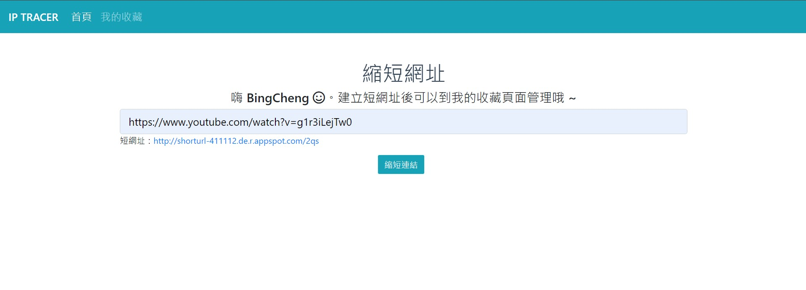
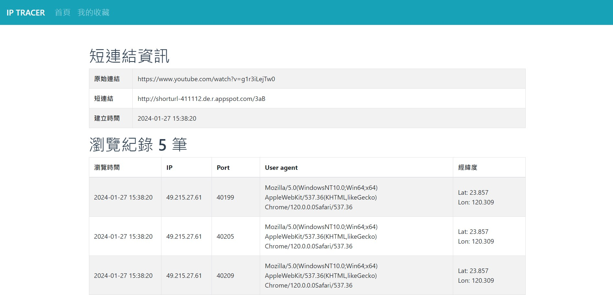
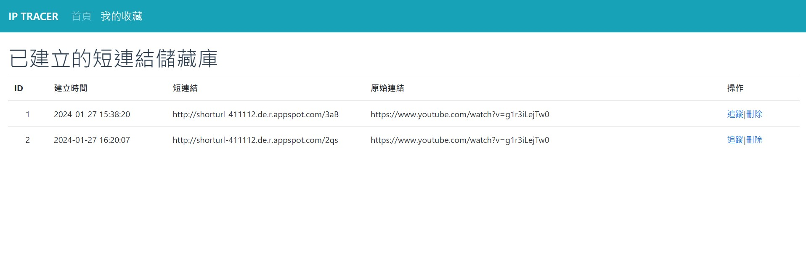

# URL Shortener

## Introduction







## Setting up a development environment
```
Create the 'env' virtual environment and activate
python -m virtualenv env
env\Scripts\activate

# Install required Python packages
pip install -r requirements.txt
```

## Initializing the Database
```
# Create DB tables
python manage.py init_db

# Init table data
python manage.py init_data
```

## Running the app
```
# Start the Flask development web server
python run.py
```

## References
* https://realpython.com/flask-blueprint/
* https://github.com/ashutoshkrris/Flask-User-Authentication-With-Email-Verification
* https://github.com/GoogleCloudPlatform/cloud-sql-python-connector#how-to-use-this-connector